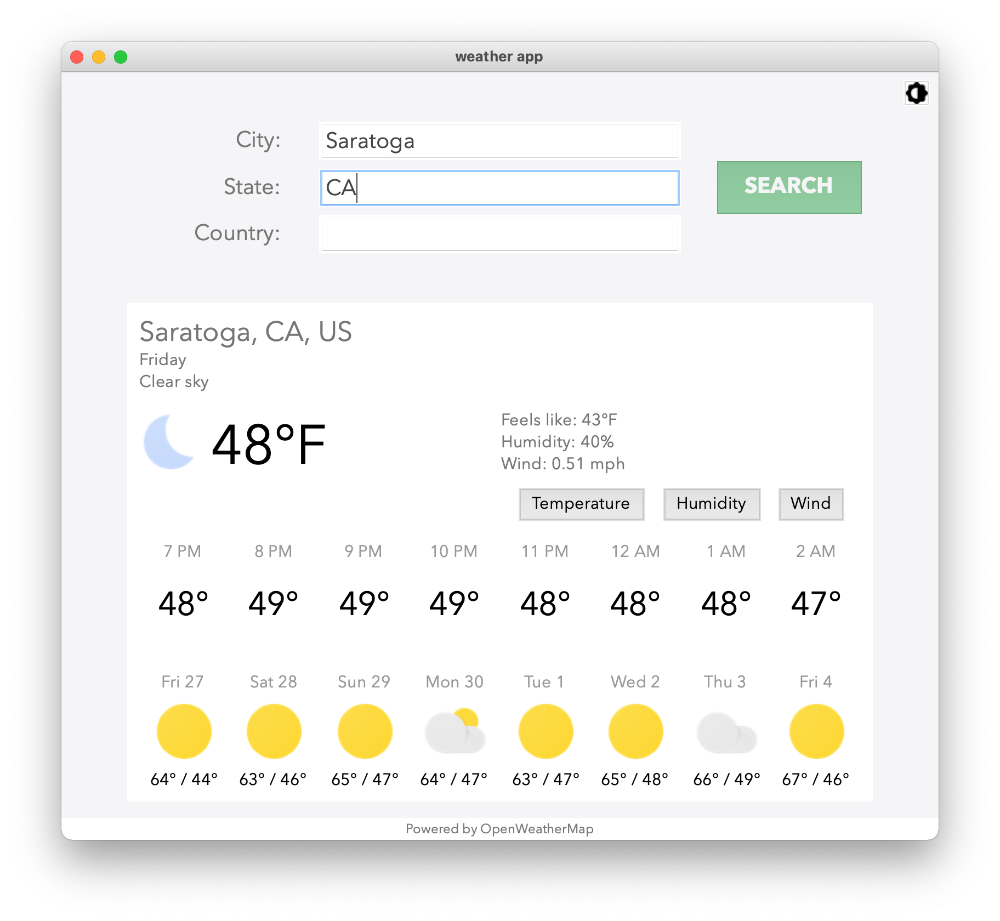
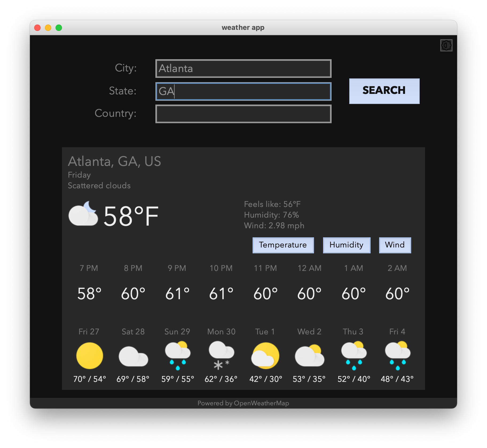

# Weather App

## Dean Stratakos
### November 23, 2020

**Weather app** harnesses the
[Open Weather Map API](https://openweathermap.org/api) to display information 
about cities worldwide. I built this app to explore the Python
[Tkinter](https://docs.python.org/3/library/tkinter.html) library, which allows
for the creation of GUIs in Python.

Time spent: **40** hours spent in total

## Functionality 

The app supports the following functionality:
- [x] Users can search for any city by typing in the city name. The state and
country can be provided as well in case there are multiple cities with the same
name.
- [x] The app displays the current weather; an hourly forecast for
temperature, humidity, and wind; and a daily forecast for the next week.
- [x] A responsive design allows the elements to scale as the window is 
resized.
- [x] The app automatically uses dark mode if run between 6 PM or 6 AM, and the
user can toggle between modes at any time.
## Screenshots

<div style="float: left;">
    
    
</div>


## Usage

Install necessary packages using `pip`, and make sure you are using Python 3.

```sh
python weather_app.py
```

## Notes

I used this command to create an executable:
```
pyinstaller --onefile --icon=Weather.ico weather_app.py
```

### Future work:
- [ ] Allow users to scroll to view more hours
- [ ] Clicking on different days updates the main info
- [ ] Tidy up executable
- [ ] Clean up line wrapping and standardize order of Tkinter optional args
- [ ] If there are multiple options for a search result, display them and let
the user choose. This can be extended to a full autocomplete feature.

## License

    Copyright 2020 Dean Stratakos

    Licensed under the Apache License, Version 2.0 (the "License");
    you may not use this file except in compliance with the License.
    You may obtain a copy of the License at

        http://www.apache.org/licenses/LICENSE-2.0

    Unless required by applicable law or agreed to in writing, software
    distributed under the License is distributed on an "AS IS" BASIS,
    WITHOUT WARRANTIES OR CONDITIONS OF ANY KIND, either express or implied.
    See the License for the specific language governing permissions and
    limitations under the License.